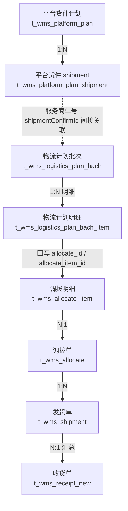

# 发货与出库流程

> 本文面向「不了解本项目、但熟悉 Java 后端」的开发者。目标是只读本文即可建立发货与出库的业务上下文。
> 阅读约定：
> - ✅ 已确认事实：直接来自当前代码库，可放心引用。
> - 🔶 代码推断：从代码行为推导，未见端到端消费方/触发配置，需要二次确认。
> - ❓ 无法确认：当前仓库无足够证据，明确标注，不猜测。
>
> 结论标注示例：`[代码证据]`、`[前端证据]`、`[推断]`、`[无法确认]`。

## 1. 业务概览

这套流程解决的是**跨境电商的头程调拨问题**：

把货物从**国内/备货仓（始发仓）**通过跨境物流送到**海外仓（第三方仓）或平台仓（如亚马逊 FBA）**，并把"计划 → 出库 → 在途 → 签收入库"全链路记录下来，同时保证**库存、单据状态、外部仓库系统（WMS/海外仓）三方一致**。

它解决的核心业务问题：

1. **计划驱动**：不是零散开单，而是先有"物流计划批次"（什么货、发多少、从哪到哪），再按批次拆成可执行的调拨与发货。
2. **库存可控**：审核时锁定库存，发货时真正扣减，防止"超卖"与"重复出库"。
3. **状态可追踪**：用「调拨单 → 发货单 → 收货单」三个单据分别跟踪计划、执行、收货三个阶段。
4. **外部系统解耦**：始发仓、目的仓可以是外部系统（领星、易仓等海外仓），通过 OpenAPI 推送出库单/入库单并轮询状态，失败可重试。

### 术语

| 术语 | 含义 |
| --- | --- |
| 始发仓（fromWhId） | 货物发出的仓库，通常是自营仓或已对接的第三方仓 |
| 目的仓（toWhId） | 货物到达的仓库，第三方仓（2）或平台仓（4） |
| 调拨发货单 / 发货单 | `t_wms_shipment`，本流程的执行单据，简称 Shipment |
| 服务商单号（shipmentConfirmId） | 平台/海外仓一侧的货件单号，FBA 场景即亚马逊 shipment ID |
| 出库单号（outboundNo） | 始发仓外部系统返回的出库单号 |
| 入库单号（inboundNo / wmsInboundNo） | 目的仓外部系统返回的入库单号 |

## 2. 整体流程

### 2.1 正常流程（当前线上主链路）


关键结论：

- **物流计划批次审核通过**（`LogisticsPlanBachServiceImpl.audit`）→ 自动生成调拨单（`AllocateServiceImpl.createAllocateByLogisticPlan`）。[代码证据]
- **调拨单"生成发货单"**（`AllocateServiceImpl.generate / batchGenerate`）→ 创建发货单并**自动审核**（`batchAuditForAllocate`，审核备注"调拨计划推单自动审核"），审核通过即**锁定库存**并进入待发货。[代码证据]
- **发货有两种触发方式**：手动"发货/手动标发"（`shipping` / `batchSend`）或"推送海外仓 → 海外仓出库 → 定时任务回写已发货"（`createOutbound` → `queryOutbound` → `afterQueryOutbound`）。[代码证据]
- **已发货后才允许生成收货单**（前端按钮 `shipmentStatus === '3' && !receiptNo`）。[前端证据]
- **收货单生成后**，由定时任务推送目的仓并轮询签收结果，签收时执行入库并把"在途"转为"可用"库存。[代码证据]

### 2.2 快速流程

对于**配置为"无需推送"的始发仓**（字典 `wms_not_push_warehouse`），创建发货单时 `outPushStatus = NO_NEED(3)`，前端直接显示"发货"按钮：待发货 → 手动发货（`shipping`）→ 已发货。[代码证据]

该场景不调用海外仓出库接口，出库动作完全由本系统库存服务完成。

### 2.3 异常流程

见 [[#11 异常与补偿]]：推送失败、出库异常回滚、截单、在途退运、取消等。

### 2.4 补推流程

物流计划已审核/执行中，但存在**未推送（NOT_PUSHED）**的明细时，通过"补推"（`supplementaryPush`）把差额同步为新的调拨单/调拨明细。[代码证据]

### 2.5 取消 / 截单

发货单仅在"待发货"可截单（`cancel`），截单即**物理删除发货单**（含明细、箱子），并回退物流计划明细状态。见 [[#11 异常与补偿]]。

## 3. 核心业务对象及关系



对象关系要点：

| 关系 | 实现方式 | 说明 |
| --- | --- | --- |
| 物流计划批次 → 调拨单 | 审核通过时 `createAllocateByLogisticPlan`；调拨单 `sourceNo`/`logisticsPlanBatchId` 记录来源 | 一个批次按"批次号+始发仓+目的仓+服务商单号"维度拆成若干调拨单；明细按"批次+SKU+MSKU+货权"合并 |
| 物流计划明细 → 调拨明细 | 调拨明细 `businessItemId` 指向物流计划明细 id；物流计划明细回写 `allocate_id` / `allocate_item_id`，状态置 PUSHED | 合并场景一个调拨明细对应多个物流计划明细 |
| 调拨单 → 发货单 | `generate` 时"一次发货、剩余甩单"：`genShipmentQty` 全部生成发货单明细 | 调拨单从 0 待推单 → 1 已推单 |
| 发货单 → 收货单 | `generateReceiptV2` 按"目的仓+是否推仓+入库类型+物流计划批次"分组汇总，发货单回写 `receiptNo` | 一个收货单可汇总多张发货单 |
| 平台货件计划 → 物流计划 | **间接**：平台货件计划确认放置地后产生 `PlatformPlanShipment`（含 `shipmentConfirmId`）；FBA 物流计划批次通过模板/导入引用该服务商单号 | 当前代码未见直接外键或自动生成 |

## 4. 物流计划批次（LogisticsPlanBach）

### 4.1 它是什么

一批"要发往同一个/同一组海外仓"的发货需求汇总。一个批次对应一份计划：计划日期、SKU、数量、始发仓、目的仓、货权层级、服务商单号（FBA 时为亚马逊 shipment ID）。

它来自两个入口：

- **FBA**：模板导入"引用 FBA 货件数据 V2"（`importLogisticsPlanByPlatformData`），数据含 `shipmentConfirmId`、FBA 箱号标签顺序等。[代码证据]
- **第三方仓/其他**：Excel 导入（`importLogisticsPlanByWarehouse`），引用采购交期发货计划（DeliveryPlan）明细生成。[代码证据]

### 4.2 它解决什么问题

把"发货计划/采购交期计划"与"实际物流执行"解耦：

- 发货计划只关心"什么时间要什么货"（`DeliveryPlanItem.releasedQty` 已下达数量）。
- 物流计划批次关心"这批货怎么组合发出去"，审核后**一次性生成调拨单**，避免人工逐单开调拨。
- 批次状态同时作为"这批货整体推进到哪一步"的汇总视图。

### 4.3 谁创建它

导入（FBA/第三方仓）或手工新建（`edit` 保存草稿）。创建时状态为 `WAIT_COMMIT`（草稿）。[代码证据]

### 4.4 它产生什么

- 审核通过（`audit`）→ 生成**调拨单**（自动）→ 调拨单生成**发货单** → 发货 → 生成**收货单**。
- 非 FBA 批次还会**占用/释放发货计划已下达数量**（`DeliveryPlanItem.releasedQty`），删除/关闭/变更时回写。[代码证据]

### 4.5 什么时候结束

所有明细均"已发货"（SHIPPED）时主单置 `FINISHED`（已完成）；草稿可手动关闭（`CLOSED`）。`CANCEL` 是历史枚举，语义同 `CLOSED`（`@Deprecated`）。[代码证据]

### 4.6 状态机

主单状态（`LogisticsPlanBachStatusEnum`）：

```text
草稿 WAIT_COMMIT
    │ 提交 commit（加 LOGISTICS_PLAN_LOCK_KEY 锁）
    ▼
待审核 WAIT_AUDIT
    │ 审核 audit（通过 isApproved=true）
    ▼
已审核 FINISH_AUDIT ──► 执行中 EXECUTING ──► 已完成 FINISHED
    │（生成调拨单）         │（存在执行中/已发货明细）│（全部明细已发货）
    │                       ▼
    └── 反审核 converseAudit（仅当无下游调拨单）→ 回草稿

草稿 WAIT_COMMIT ──► 已关闭 CLOSED（close，仅草稿；有下游调拨单则禁止）
```

为什么允许这些转换：

- **只有草稿能提交/关闭**：避免已进入流程的计划被随意改动。
- **只有待审核能审核**：审核是唯一入口，防止重复提交。
- **只有已审核能反审核**：反审核要求**没有任何下游调拨单**（`converseAudit` 校验 `Allocate.sourceNo`），防止已下推的数据被回退。

明细状态（`LogisticsPlanBachItemStatusEnum`）是**由下游状态推导的重算结果**，不独立流转：

```text
未推送 NOT_PUSHED（无调拨关联 / 调拨被删后回退）
    → 已推送 PUSHED（已关联调拨单，调拨单尚未生成发货单）
    → 执行中 EXECUTING（关联调拨单已有发货单，但未全部发货）
    → 已发货 SHIPPED（关联调拨单存在已发货状态的发货单）
```

推导逻辑位于 `recalculateLogisticsPlan`：只要有任一发货单已发货即明细为 SHIPPED；有发货单但未发货为 EXECUTING；仅有调拨无发货单为 PUSHED。主单状态由明细聚合：存在 EXECUTING → EXECUTING；全部 SHIPPED → FINISHED；存在 PUSHED → FINISH_AUDIT。[代码证据]

## 5. 调拨单（Allocate）

### 5.1 它是什么

一张"**始发仓 → 目的仓**"的调拨计划单。它把物流计划明细按（批次号、始发仓、目的仓、服务商单号）分组，并把同一 SKU+MSKU+货权维度的明细合并成调拨明细。[代码证据]

### 5.2 它解决什么问题

没有调拨单时，"计划"和"发货"之间缺少一个**可校验、可追溯的执行单元**：

- 调拨单承载"这个仓到那个仓需要发什么"的完整清单。
- 调拨单校验 SKU 维护完整性（始发仓/目的仓第三方 SKU 是否存在、箱规是否完整）。
- 调拨单被删除时，物流计划明细能整体回退"未推送"，实现**可回滚的计划下推**。

### 5.3 谁创建它

- **物流计划审核通过时自动创建**（`createAllocateByLogisticPlan`）。
- 物流计划"补推/变更"时增量创建（`syncAllocationPlan` 中 `createNewAllocItems` 分支）。
- 手动新增（`add`，前端"新增调拨"入口仍在）。[前端证据]

### 5.4 它产生什么

- 调拨明细 `genShipmentQty` 默认等于 `allocateQty`（"实发数量和调拨数量一致"，2025-08-18 注释）。
- "生成发货单"后产生**发货单**，调拨状态 0 → 1。
- 回写物流计划明细：`allocate_id`、`allocate_item_id`、状态 PUSHED。[代码证据]

### 5.5 什么时候结束

生成发货单并自动审核后，调拨单即"已推单"（1），此后不可再生成发货单、不可反审核（存在发货单时 `converseAudit` 拒绝）、不可删除（`delete` 仅允许待推单）。[代码证据]

### 5.6 状态机

```text
待推单 0（NEW）
    │ 生成发货单 generate / batchGenerate（ALLOCATE_LOCK_KEY 锁）
    │ 校验：调拨单必须为待推单；SKU 维护完整；实发数量非 0
    ▼
已推单 1（FINISH_AUDIT）
    │ 反审核 converseAudit（仅当无关联发货单）
    ▼
待推单 0
```

特殊规则：

- 若某调拨单所有明细 `genShipmentQty == 0`（全部甩单/不发），生成时直接置为已推单（不创建发货单）。[代码证据]
- 状态 `-1`（`WAIT_AUDIT`，历史命名"待审核"）为弃用值，枚举注释明确 `20250724 修改状态 1 改为已推单，不改命名`。[代码证据]

## 6. 发货单（Shipment）

### 6.1 它是什么

一张**实际发运的单据**：从哪个始发仓、走哪个物流渠道、发往哪个目的仓、发哪些 SKU、装箱明细、是否 FBA、出库单号、运单号、收货单号。它是整个流程的执行核心。[代码证据]

### 6.2 它解决什么问题

- 把调拨计划变成**可执行、可追踪**的发货指令。
- 承载**装箱信息**（第三方仓/FBA 需要箱唛、箱号才能收货）。
- 承载**对外推送状态**（出库推送/入库推送），把"业务状态"与"外部系统同步状态"分开。

### 6.3 谁创建它

- **调拨单"生成发货单"**（当前主路径，`AllocateServiceImpl.generate / batchGenerate` → `ShipmentServiceImpl.createShipmentByAllocate`）。
- 前端"新增发货单"入口仍存在（`add`），但**当前主流程不经过**它；`submit/audit/batchSubmit/batchAudit/batchDelete/delete` 前端已无有效入口。[前端证据]

### 6.4 它产生什么

- 审核通过 → **锁定库存**（`SHIPMENT_BOOKING`，占用库存表 `InventoryLock`）。
- 发货 → **扣减锁定库存**（`SHIPMENT_OUTBOUND`），生成调拨在途（目的仓维度）。
- 推送海外仓 → 拿到 `outboundNo`、`trackingNo`。
- 生成收货单 → 回写 `receiptNo`，收货单汇总发货明细。
- 发货/截单/收货都会触发 `logisticsPlanBachService.updateStatusByShipment` 重算物流计划。[代码证据]

### 6.5 什么时候结束

没有"完成"状态（枚举中 `COMPLETED(4)` 已注释弃用）。发货单的终点是 **已发货（3）** + 关联的收货单签收完毕。收货完成体现在收货单状态，而非发货单。[代码证据]

### 6.6 状态机

```text
草稿 0（NEW）──（旧链路，前端已无入口）──► 待审核 1（AUDIT）

待审核 1（AUDIT）
    │ 审核 audit / batchAuditForAllocate（自动审核：调拨计划推单自动审核）
    │ 自动质检/调整（getNeedAutoList → doAutoQcInAndAdjust）
    │ 锁定库存 occupyInventory（SHIPMENT_BOOKING）
    ▼
待发货 2（SHIPPING）
    │ 方式A：推送海外仓 pushToThirdWh / 定时任务 createOutboundJob
    │        → outPushStatus=SUCCESS(1)，等待海外仓出库
    │        → 定时任务 queryOutboundJob → 海外仓已出库 → 系统出库 + 已发货
    │ 方式B：无需推送（NO_NEED=3）→ 手动发货 shipping / 手动标发 batchSend
    ▼
已发货 3（SHIPPED）
    │ 生成收货单 generateReceiptV2（前端按钮）/ 平台仓自动 autoGeneratePlatReceipt
    ▼
（收货单阶段，见 [[收货与入库流程]]）
```

状态转换细节：

| 转换 | 触发 | 前置条件 | 数据变化 | 外部调用 | 锁 |
| --- | --- | --- | --- | --- | --- |
| 待审核 → 待发货 | 审核通过 | 状态=AUDIT | 状态置 SHIPPING；占用库存（可用→BOOKING） | 无（自动质检可能调用库存调整） | `ALLOCATE_SHIPMENT_LOCK_KEY` |
| 待发货 → 已发货（手动） | `shipping` / `batchSend` | 状态=SHIPPING；装箱信息非空；`shipping` 还要求 `outPushStatus=NO_NEED` | 扣减锁定库存；生成调拨在途；状态置 SHIPPED | 无（`batchSend` 额外持有仓库库存锁） | `ALLOCATE_SHIPMENT_LOCK_KEY` + `INVENTORY_AVAILABLE_LOCK_KEY` |
| 待发货 → 已发货（外部） | 定时任务 | 状态=SHIPPING；outPushStatus=SUCCESS | 回写 trackingNo/fromWhStatus；扣减锁定库存；状态置 SHIPPED | OpenAPI queryOutbound | `SHIP_QUERY_OUTBOUND_LOCK_KEY` |
| 待发货 → 截单 | `cancel` | 状态=SHIPPING | 取消外部出库单；释放库存；**删除发货单+明细+箱子**；重算物流计划 | OpenAPI cancelOutbound（若已推送成功） | `ALLOCATE_SHIPMENT_LOCK_KEY` |

## 7. 始发仓出库（库存变化核心）

### 7.1 什么动作真正减少始发仓库存？

**是发货动作（shipping / batchSend / 外部出库回写），不是生成发货单。**

完整库存链路：[代码证据]

```text
生成发货单：不动库存
    │
审核（自动/手动）：占用库存
    │  可用库存 -Q → 锁定库存 +Q（InventoryLock 记录，业务类型 SHIPMENT_BOOKING=-300）
    ▼
发货（shipping / batchSend / afterQueryOutbound）：
    │  AllocateOutboundServiceImpl.addOutbound（SHIPMENT_OUTBOUND=-3）
    │  校验锁定库存存在 → deductInventoryLock（锁定库存 -Q）
    │  → 私有库存/总库存扣减 → FIFO 批次扣减
    │  → 生成"批次在途"（InventoryBatchOnroad，whId=目的仓）
    │  → 目的仓调拨在途库存 +Q
    ▼
目的仓签收（收货单）：
    │  AllocateInboundServiceImpl.addInbound（SHIPMENT_INBOUND=3）
    │  目的仓可用库存 +Q；调拨在途 -Q（批次在途结清）
    ▼
完成
```

### 7.2 使用什么出库单据？

统一走 `OutboundTypeFactory` 的 `AllocateOutboundServiceImpl`，业务类型 `SHIPMENT_OUTBOUND`（-3，调拨出库），FIFO 批次策略。它不是 `OtherOutbound`。[代码证据]

### 7.3 出库与发货状态是否同步？

**在同一个本地事务内**：`shipping` 中 `outboundType.addOutbound` 与 `shipment.setShipmentStatus(SHIPPED)` 处于同一 `@Transactional`。[代码证据]

`afterQueryOutbound`（外部出库回写）同样是 `@Transactional`，先 `addOutbound` 再置 SHIPPED。[代码证据]

### 7.4 事务边界与一致性

- **审核的占用**：`AbstractOccupyServiceImpl.occupyInventory` 持有 `INVENTORY_AVAILABLE_LOCK_KEY + whId` 分布式锁，核心扣减在 `OccupyTrxServiceImpl.doOccupyInventory`（独立 REPEATABLE_READ 事务）执行。[代码证据]
- **发货的扣减**：`AllocateOutboundServiceImpl.addOutbound` 是 `@Transactional`；`shipping` 本身也是 `@Transactional`。二者在同一事务链中。
- **没有 Seata**：未发现 `@GlobalTransactional` / Seata 引用。跨系统一致性靠"推送 + 轮询 + 状态机"补偿。[代码证据]
- **重复出库防护**：`AllocateOutboundServiceImpl.addOutbound` 先查锁定库存，无锁定库存直接抛"锁定库存不存在"；`InventoryLock` 记录含 `businessNo + businessType`，`deductInventoryLock` 按剩余锁定数量扣减。**发货单状态 + 锁定库存双重校验**防重复。[代码证据]

### 7.5 WMS 出库成功但后续失败？

出库与状态更新在同一事务：若出库成功但后续更新失败，**整个事务回滚**（含库存扣减）。不存在"WMS 扣了但状态没改"的窗口。若业务系统崩溃于提交瞬间，事务由数据库保证原子性；外部系统是否按 `referenceNo` 幂等，**当前仓库无法确认**。❓

## 8. 第三方仓 / 平台仓（目的仓侧）

### 8.1 出库推送（始发仓 → 海外仓）

```text
什么时候调用：
    定时任务 shipmentCreateOutboundJobHandler（未推送/推送失败 + 待发货）
    或前端"推送海外仓 / 批量推送海外仓"
    ▼
调用什么：remoteOpenapiWhService.createOutbound（ExtWarehousePushOrderReq）
    ▼
传递对象：发货单 + 明细 + 箱子 + 收货人地址（FBA 取亚马逊货件地址）+ 物流渠道编码
    ▼
成功后：回写 outboundNo、outPushStatus=SUCCESS(1)
    ▼
失败后：outPushStatus=FAIL(2)；重试计数写 Redis（SHIP_CREATE_OUTBOUND_RETRY_KEY）
    ▼
重试：定时任务每次扫描 FAIL 重新推送；达到 3 次后置 FAIL 并记录日志（不自动回退草稿）
```

注意：[代码证据]

- `createOutbound` 内部"明确失败"（resp.error 非空）走 `rollbackAllocateOutbound`：置 `outPushStatus=FAIL`，但**不改 shipmentStatus**（注释掉的 `NEW` 未启用）。
- 达到重试次数上限后调用 `rollbackAllocateOutbound` 并清空计数，仍只置 FAIL，**不会自动回退草稿**。

### 8.2 出库状态轮询（海外仓 → 本系统）

```text
什么时候调用：定时任务 shipmentQueryOutboundJobHandler
    ▼
调用什么：remoteOpenapiWhService.queryOutbound（warehouseNo + referenceNo + billType=ALLOCATE_ORDER）
    ▼
成功后：
    回写 trackingNo、fromWhStatus
    若海外仓状态=已出库（WhOrderStatusEnums.isDelivered）：
        系统执行 SHIPMENT_OUTBOUND 出库 → 状态置 SHIPPED(3) → 重算物流计划
    ▼
失败/异常：
    resp.error 非空 → 回滚为草稿（outboundNo 清空、状态 NEW、outPushStatus=NOT_PUSH）
    → 释放库存 → 调 cancelOutbound 取消外部出库单
    ▼
重试：下次定时任务重新扫描（NOT_PUSH + 待发货）
```

### 8.3 入库推送（收货单 → 目的仓）

当前实现以 `ReceiptNewServiceImpl` 为准（`ShipmentServiceImpl` 中同名旧方法已被定时任务注释掉）：

```text
什么时候调用：定时任务 shipmentCreateInboundJobHandler → receiptNewService.createInboundJob()
    ▼
调用什么：remoteOpenapiWhService.createInbound（按收货单维度，referenceNo=收货单号）
    ▼
成功后：收货单 orderStatus=SUCCESS(5)，回写 extInboundNo（wmsInboundNo）到收货单/明细/箱子
    ▼
失败后：收货单 orderStatus=FAIL(10)，下一轮重试
```

### 8.4 入库状态轮询与签收

```text
定时任务 shipmentQueryInboundJobHandler → receiptNewService.queryInboundJob()
    → 对 SUCCESS 且未收货的收货单 queryInbound
    → 海外仓已入库（isDelivered）→ afterQueryInbound
    → 一件代发（DROP_SHIPPING）：receiveByThirdSku 自动签收
    → 中转入库（TRANSIT_SHIPPING）：按箱子更新收货数量（buildNewInboundV2）
    → 执行 SHIPMENT_INBOUND 入库（在途→可用）
```

平台仓（whType=4）默认不推目的仓（`autoGeneratePlatReceipt` 置 `destinationPushOrNot=1`，收货单 `orderStatus=99`），前端仅手动签收/整单签收。[代码证据 + 前端证据]

## 9. FBA / PlatformPlan

### 9.1 PlatformPlan 是什么

平台货件计划（备货计划，`t_wms_platform_plan`），是 **FBA 向亚马逊创建入库计划的编排单据**。它本身不直接出库，而是与亚马逊 SP-API 交互，逐步确认"打包分组 → 放置地 → 运输方式"，最终拿到亚马逊货件（shipment）与服务商单号（`shipmentConfirmId`）。[代码证据]

### 9.2 它在流程中的位置

```text
PlatformPlan（备货计划）
    │ 确认放置地后生成 PlatformPlanShipment（shipmentId + shipmentConfirmId）
    ▼
亚马逊侧货件数据
    │ 通过模板"引用 FBA 货件数据 V2"导入
    ▼
物流计划批次（FBA）→ 调拨 → 发货 → 出库 → FBA 仓库签收
```

**重要**：PlatformPlan 与 LogisticsPlanBach / Shipment **没有直接外键**。`LogisticsPlanBach` 持有 `shipmentConfirmId`，FBA 物流计划通过导入引用该单号；发货单的 `inboundNo`（服务商入库单号，FBA 即亚马逊 shipment ID）也来自 `Allocate.shipmentId`。[代码证据]

### 9.3 为什么需要它

亚马逊 FBA 入库不是"直接下单"，而是一系列 SP-API 操作（创建入仓计划、确认打包、确认放置地、确认运输、预报）。PlatformPlan 把这些步骤编排成状态机，保存中间结果（箱子、货件、地址、运输方式），供后续导入物流计划使用。

### 9.4 SP-API 与业务阶段对应

| 阶段 | SP-API 动作 | 系统行为 | 人工/自动 |
| --- | --- | --- | --- |
| 创建入库计划 | createPlan | submit：状态 0→1（AMAZON）或 0→8（OTHER）；回调失败回 0 | 人工提交，异步回调 |
| 打包分组生成 | 回调 GENERATE_PACKING_OPTIONS | 状态 → WAIT_PACKAGE(2)，保存装箱信息 | 自动（回调） |
| 确认打包 | confirm（ConfirmPackingOptionReq） | 状态 → IN_PACKAGING(3)；保存 Box/BoxItem | 人工确认（确认打包信息弹窗） |
| 生成放置地 | 回调 GENERATE_PLACEMENT_OPTIONS | 状态 → WAIT_PLACEMENT(4) | 自动（回调） |
| 确认放置地 | placementConfirm | 生成 PlatformPlanShipment + 收货地址；状态 → IN_SEPARATING(5) | 人工确认（确认放置选项弹窗） |
| 生成运输方式 | 回调 GENERATE_DELIVERY_WINDOW_OPTIONS | 状态 → WAIT_TRANSPORT(6) | 自动（回调） |
| 确认运输 | confirmTransportAndDeliveryWindow | 保存承运商/运输方式；状态 → IN_TRANSPORT(7) | 人工确认（确认运输弹窗） |
| 箱号匹配/上传装箱 | LIST_SHIPMENT_BOXES / SET_PACKING_INFORMATION_REAL / setPackingInformation | 状态 → WAIT_AUDIT(8)；已知装箱信息主动上传，未知装箱信息等待回调 | 自动 + 回调 |
| 审核 | audit（本地） | 状态 → WAIT_PRE(9)；拒绝则作废 | 人工 |
| 预报 | finish（本地） | 状态 → COMPLETED(10) | 人工（"提交调拨发货"入口） |

### 9.5 PlatformPlan 与 Shipment 状态是否联动

**没有联动。** PlatformPlan 状态机到 `COMPLETED(10)` 即结束；发货单的推进由物流计划/调拨链路控制，二者只通过 `shipmentConfirmId` 在导入时发生关系。[代码证据]

### 9.6 前端/后端不一致（需要人工确认）

🔶 前端 `scm/shipmentPlan/index.vue`：

- "提交调拨发货"按钮在 `planStatus === '9'` 时调用 `shippingPlanSubmitAllotApi`（POST `/wms/platformPlan/submitAllot`），但**后端 Controller 只有 `/finish`，无 `/submitAllot`**。该按钮点击后会 404。[前端证据 + 代码证据]
- 按钮显示条件与后端校验不一致：前端在状态 3/5/7 显示"确认打包/放置/运输"，后端 `confirmPack` 要求 WAIT_PACKAGE(2)、`confirmPlacement` 要求 WAIT_PLACEMENT(4)、`confirmTransport` 要求 WAIT_TRANSPORT(6)。若状态流转按回调推进（2→3→4→5→6→7），前端按钮展示条件与后端校验恰好错位。

> 上述两点属于"代码推断的不一致"，线上实际可用性**无法从当前仓库确认**（可能与前端版本、网关路由、后续分支有关），请在改这段代码前与前端/业务确认。

## 10. 收货与入库

详见 [[收货与入库流程]]。与本流程衔接的关键点：

- 收货单由**已发货**的发货单生成：手动（`generateReceiptV2` 预览后确认）或平台仓定时任务（`autoGeneratePlatReceipt`）。
- 收货单状态（`ReceiptNewStatusEnum`）：0 未收货 → 5 部分收货 → 10 已收货；`收货 + 退运 >= 发货数量` 即完结。
- 收货单推送状态（`ReceiptOrderStatusEnum`）：0 未推送 / 5 推送成功 / 10 推送失败 / 99 无需推送。
- 签收方式：手动签收、整单签收、批量整单签收、第三方自动签收（wayfair 等）。
- 签收后回写发货明细 `receivedQty`，并触发调拨入库（`SHIPMENT_INBOUND`）把"调拨在途"转"可用"。

## 11. 异常与补偿

### 11.1 推送失败（出库推送）

- 触发：`createOutbound` 外部返回错误或异常。
- 状态变化：`outPushStatus` 0/1 → 2（FAIL）；`shipmentStatus` 保持 SHIPPING。
- 数据变化：不产生 outboundNo；重试计数写 Redis（`SHIP_CREATE_OUTBOUND_RETRY_KEY`）。
- 外部影响：失败时不调用取消（未成功创建）；若创建成功但响应解析失败，下次重试可能产生重复出库单（❓ 依赖外部系统按 referenceNo 幂等，未确认）。
- 恢复：定时任务自动重试；前端"推送海外仓"也可手动重试（仅 NOT_PUSH/FAIL 允许）。

### 11.2 出库单异常回滚（afterQueryOutbound 收到 error）

- 触发：海外仓返回错误（如无法发货）。
- 状态变化：SHIPPING → NEW（草稿），outPushStatus → NOT_PUSH。
- 数据变化：清空 outboundNo/trackingNo/fromWhStatus；释放库存锁定；**取消外部出库单**。
- 恢复：人工重新走"生成发货单后的流程"（重新推送/发货）。

### 11.3 发货失败

- `shipping` 中出库与状态更新同一事务，任一失败整体回滚（库存、状态都不变）。[代码证据]
- 若"装箱信息为空"，事务回滚，发货单保持 SHIPPING。

### 11.4 截单（cancel）

- 触发：待发货（SHIPPING）状态人工"截单"。
- 状态变化：发货单**删除**（不是状态流转）；`outPushStatus` 置回 NOT_PUSH 并清空 outboundNo/trackingNo。
- 数据变化：删除发货明细、箱子；释放库存锁定；若已推送成功先取消外部出库单；物流计划明细重算（可能回退 PUSHED/EXECUTING）。
- 外部影响：调用 `cancelOutbound`（仅当 outPushStatus=SUCCESS）。
- 恢复：不可恢复——单据已删除；调拨单回到待推单可重新生成发货单。

### 11.5 在途退运（ReturnOnroad）

- 触发：发货单**已发货（3）**且仍有未签收/未退运数量；退运数量须为整箱倍数。
- 执行（`createReturnOnroad`，单事务）：
  1. 校验数量上限（发货 - 签收 - 已退运）；
  2. 创建退运单（前缀 SRT）；
  3. 目的仓在途库存出库（RETURN_ONROAD_OUTBOUND，-8）；
  4. 退回仓入库（RETURN_ONROAD_INBOUND，8，供应商/自营仓货权归 ALL）；
  5. 回写发货明细 returnedQty、箱子状态、收货单数量。
- 详见 [[退货与退运流程]]。

### 11.6 调拨删除 → 物流明细回退

- 触发：删除待推单状态的调拨单（`AllocateServiceImpl.delete`）。
- 数据变化：`onAllocateDelete` 清除物流计划明细的 allocateId/allocateItemId，状态置回 **NOT_PUSHED**。
- 目的：把"计划 → 调拨"这一步做成**可逆的**——调拨删除不代表计划取消，只是退回未下推状态，可重新生成。

### 11.7 补推

- 触发：物流计划已审核/执行中，存在未推送明细（如变更新增、上次推送部分失败、删除调拨后未重推）。
- 执行：`supplementaryPush` → `syncAllocationPlan`：已有调拨则更新数量/新增明细；无匹配调拨则新建；数量降为 0 删除明细。
- 约束：执行中/已发货明细不参与；调拨已下推发货单的不允许变更。

## 12. 状态机总览

### 12.1 物流计划批次

见 [[#4.6 状态机]]。

### 12.2 调拨单

```text
待推单 0 ──生成发货单+自动审核──► 已推单 1
   ▲                              │
   └────────反审核（无发货单）─────┘
```

### 12.3 发货单

```text
待审核 1 ──审核（占用库存）──► 待发货 2 ──发货/外部出库──► 已发货 3
   ▲                                                        │
   └──────────出库异常回滚（NEW）←──────────────────────────┘
```

### 12.4 什么是"真正的业务状态"，什么是"技术状态"

| 状态 | 性质 | 说明 |
| --- | --- | --- |
| 物流计划主单状态 | 业务 | 计划推进到哪一步（草稿→已审核→执行中→完成） |
| 物流计划明细状态 | **派生/技术** | 由调拨、发货单状态重算，不独立流转 |
| 调拨单 0/1 | 业务 | 是否已下推发货单 |
| 发货单 0/1/2/3 | 业务 | 草稿/待审核/待发货/已发货 |
| `outPushStatus` | **技术** | 始发仓出库单与外部系统同步状态（0/1/2/3） |
| `inPushStatus` | **技术** | 目的仓入库单推送状态（0/1/2/3） |
| `fromWhStatus`/`toWhStatus` | 技术 | 外部仓库返回的状态文本 |
| 收货单 receiveStatus | 业务 | 收货进度 |
| 收货单 orderStatus | **技术** | 目的仓入库推送状态 |
| 调拨 `-1` | 历史遗留 | 弃用值，勿用于新逻辑 |
| 物流计划 `CANCEL` | 历史遗留 | 已作废语义，代码映射到 CLOSED |

## 13. 关键业务规则与不变量

1. **只有待推单的调拨单才能生成发货单**（`checkAllocateStatus`）。防止重复生成同一调拨的发货单。[代码证据]
2. **只有待发货且（未推送/推送失败）才能推送海外仓**；只有待发货且无需推送才能手动发货（`shipping`）；只有待发货才能截单。[代码证据]
3. **审核即锁库存，发货才扣库存**（SHIPMENT_BOOKING → SHIPMENT_OUTBOUND）。锁库存防止超卖；扣减要求锁定库存存在，防止无锁出库。[代码证据]
4. **发货数量必须是单箱数量整数倍**（`createShipmentByAllocate` 校验 `shipmentQty % boxPcs == 0`）。[代码证据]
5. **始发仓/目的仓为已对接第三方仓时，SKU 维护必须完整**（deliverThirdSku / thirdSku 非空），否则生成发货单失败。[代码证据]
6. **FBA 发货单生成时必须有可用 FBA 箱号**（`buildErpBoxFromFbaBox`，无箱号直接抛错）。[代码证据]
7. **生成收货单幂等**：已回写 `receiptNo` 的发货单不可再次生成（`generateReceiptV2` 校验 + 全局锁 `wm:SummaryGenerateReceipt`）。[代码证据]
8. **调拨删除可逆、发货单截单不可逆**：调拨删除回退物流明细为未推送；截单删除发货单。[代码证据]
9. **执行中/已发货的物流明细不可变更/删除**；已下推发货单的调拨不可变更（`syncAllocationPlan` 抛"调拨计划已下推发货单，不允许变更"）。[代码证据]
10. **分布式锁**：物流计划 `LOGISTICS_PLAN_LOCK_KEY+id`；调拨 `ALLOCATE_LOCK_KEY+id`；发货单 `ALLOCATE_SHIPMENT_LOCK_KEY+id`；出库查询 `SHIP_QUERY_OUTBOUND_LOCK_KEY+id`；入库 `SHIP_CREATE_INBOUND_LOCK_KEY+receiptId`；库存 `INVENTORY_AVAILABLE_LOCK_KEY+whId`。[代码证据]
11. **库存操作统一走 Factory**：业务方不直接改库存表（`InboundTypeFactory` / `OutboundTypeFactory` / `OccupyTypeFactory` / `ReleaseTypeFactory`）。[代码证据]

## 14. 当前有效流程与废弃流程

### 14.1 当前有效流程

```text
物流计划批次：导入/新建 → 提交 → 审核（自动生成调拨单）→ 变更/补推
调拨单：待推单 → 生成发货单（单个/批量）→ 已推单
发货单：待审核（自动）→ 自动审核 → 待发货 →（推送海外仓 / 手动发货）→ 已发货
收货：生成收货单（手动/平台仓自动）→ 推送目的仓 → 轮询 → 签收/入库
```

前端当前活跃入口（2026-08-12 核对）：[前端证据]

- 物流计划批次：提交、审核、变更、补推、反审核、关闭（批量关闭）；导入 FBA V2 / 第三方仓；批量更新物流标签。
- 调拨：生成发货单（单个/批量）、反审核、删除（待推单）、导入实发数量、下载模板。
- 发货单：编辑（待发货）、发货（无需推送）、推送海外仓/批量推送、手动标发、截单、生成收货单（已发货）、在途退运、日志。
- 收货单：手动签收、整单签收、批量整单签收、导出、日志。

### 14.2 历史流程（不要按它理解当前业务）

```text
旧链路（前端已注释/后端仍存在）：
调拨单：新建 → 提交（发起钉钉审核）→ 审核 → 已推单
发货单：草稿 → 提交 → 审核 → 待发货
```

对应方法：`AllocateService.submit / audit`（均 `@Deprecated`）、`ShipmentService.submit / audit / batchSubmit / batchAudit / delete / batchDelete`、`ShipmentController.downloadFbaBoxFiles / downloadFbaFnSkuLabel`（已注释）、`LogisticsPlanBach.bachRemove / remove`（前端无入口）、旧平台导入 `importLogisticsPlanByPlatform` / `importFbaLogisticsPlanByPlatform`（Controller 已注释）。[代码证据 + 前端证据]

### 14.3 为什么不能按旧流程理解

当前生产由"**调拨推单自动审核**"直接进入待发货，没有人工提交/审核环节。发货单枚举中 `AUDIT(1)` 只是生成与审核之间的瞬时态；`NEW(0)` 在前端列表中被隐藏（`data.ts` 只展示 2/3）。若按"草稿→提交→审核"理解，会误以为存在人工审核环节，进而设计出重复的审批流。[前端证据]

### 14.4 废弃接口清单

见 [[前端WMS废弃接口清单]]（A/B/D 类判定）。发货相关重点：

- A 类：`logisticsPlanBach/remove`、`importFbaLogisticsPlanByPlatform`、`shipment/downloadFbaBoxFiles`、`downloadFbaFnSkuLabel`。
- B 类：`shipment/add`、`edit`、`deleteBox`、`generateReceipt`（旧版）、`logisticsPlanBach/bachRemove`、`bachConverseAudit`。
- D 类：`allocate/submit`、`allocate/audit`、`allocate/export`、`shipment/submit`、`audit`、`batchSubmit`、`batchAudit`、`batchDelete`、`delete`、`checkFileExists`、`downloadBatchError`。

> 注：D 类接口后端仍存在、前端页面仍 import，但**无有效 UI 触发**。它们不应被当作当前流程入口；若未来恢复按钮，需同步更新清单。

## 15. 开发修改注意事项

### 15.1 核心入口

- `LogisticsPlanBachServiceImpl`：批次生命周期（commit/audit/close/change/supplementaryPush/recalculateLogisticsPlan/onAllocateDelete/updateStatusByShipment）。
- `AllocateServiceImpl`：`createAllocateByLogisticPlan`、`generate / batchGenerate`、`converseAudit`、`delete`。
- `ShipmentServiceImpl`：`createShipmentByAllocate`、`audit / batchAuditForAllocate`、`shipping / batchSend`、`pushToThirdWh / batchPushToThirdWh`、`createOutbound / queryOutbound / afterQueryOutbound`、`generateReceiptV2 / autoGeneratePlatReceipt`、`cancel`。
- `ReceiptNewServiceImpl`：`generateReceiptFromPreView`、`createInbound / queryInbound / afterQueryInbound`、`receive / receiveAll / receiveByThirdSku`。
- `ReturnOnroadServiceImpl.createReturnOnroad`。
- `PlatformPlanServiceImpl`：FBA 编排（submit/fbaCallback/confirmPack/confirmPlacement/confirmTransport/audit/finish）。

### 15.2 不能破坏的状态转换

- 物流计划：只有草稿可提交/关闭；只有待审核可审核；只有已审核可反审核。
- 调拨：只有待推单可生成发货单/删除；已推单反审核必须无发货单。
- 发货单：只有待发货可推送/发货/截单；只有待审核可审核；已发货不可回退（除出库异常回滚）。

### 15.3 会产生库存变化的操作

- 审核通过：占用库存（SHIPMENT_BOOKING）。
- 发货/手动标发/外部出库回写：扣减锁定库存 + 生成在途（SHIPMENT_OUTBOUND）。
- 签收入库：在途→可用（SHIPMENT_INBOUND）。
- 截单/出库异常回滚：释放库存（SHIPMENT_RELEASE）。
- 在途退运：RETURN_ONROAD_OUTBOUND / RETURN_ONROAD_INBOUND。

### 15.4 会调用外部系统的操作

- `remoteOpenapiWhService.createOutbound / queryOutbound / cancelOutbound / createInbound / queryInbound`（海外仓）。
- `remoteAmazonService.*`（PlatformPlan 流程、FBA 地址/标签）。
- `remoteSystemService.getDictData("wms_not_push_warehouse")`（是否推送）。
- 库存同步 MQ：`InventorySendListener`（消费外部库存变更，不是发货链路主动发 MQ）。发货链路本身**没有 MQ 生产者**，全部靠定时任务轮询。

### 15.5 会产生 MQ / RPC 的操作

- 发货链路：**无 MQ**；RPC 为上述 OpenAPI/Amazon 调用。
- 库存外部同步：`InventoryMqDto` 消费（与发货无直接耦合）。

### 15.6 有分布式锁的操作

- 批次：`LOGISTICS_PLAN_LOCK_KEY`（批量操作使用 MultiLock）。
- 调拨：`ALLOCATE_LOCK_KEY`（批量 MultiLock；注意 `checkMultipleLock` 中 leaseTime 参数与注释不一致）。
- 发货单：`ALLOCATE_SHIPMENT_LOCK_KEY`。
- 出库/入库轮询：`SHIP_QUERY_OUTBOUND_LOCK_KEY` / `SHIP_CREATE_INBOUND_LOCK_KEY`（任务级另有全局锁）。
- 库存：`INVENTORY_AVAILABLE_LOCK_KEY + whId`（占用、扣减、退运）。

### 15.7 历史遗留代码

- 发货单 `submit / audit / batchSubmit / batchAudit / batchDelete / delete`（前端无入口）。
- 调拨 `submit / audit`（`@Deprecated`，钉钉审批残留）。
- 物流计划 `CANCEL` 枚举、旧版 `importLogisticsPlanByPlatformData`、`ShipmentServiceImpl.createInbound`（单发货单版，已空实现）、旧版 `queryInbound`。
- `AllocateStatusEnum.WAIT_AUDIT(-1)`。
- `ShipmentStatusEnum.COMPLETED(4)` 已注释。

### 15.8 存在但当前不能作为有效入口的接口

- 前端 `shippingPlanSubmitAllotApi`（`/wms/platformPlan/submitAllot`）：后端无映射，会 404。
- 旧版 `generateReceipt`（B 类）。
- `createShipmentByAllocate`（Controller 入口）：Service 实现为空，前端 `createShipmentByAllocateApi` 无有效调用；调拨生成发货单走的是 AllocateService 内部逻辑。

### 15.9 幂等 / 重复执行风险

- **生成发货单**：调拨状态校验 + 分布式锁防并发；`doGenerate` 中审核失败会抛错并回滚整个事务（同一事务），不会残留半成品。
- **推送海外仓**：`createOutbound` 无本地幂等表；重复调用依赖外部系统按 `referenceNo` 幂等，❓ 未确认。
- **生成收货单**：`receiptNo` 回写 + 全局锁防重复。
- **签收**：`RECEIPT_LOCK_KEY` 防并发签收；收货数量以"收货+退运 ≤ 发货数量"为上限。
- **出库**：锁定库存不存在即拒绝，防无锁出库；但 `batchSend` 与 `shipping` 是两套入口，若未来同时放开，需确保状态校验 + 锁一致（当前前端条件已区分 outPushStatus）。

## 16. 待确认问题

1. ❓ PlatformPlan 前端"提交调拨发货"调用的 `/platformPlan/submitAllot` 后端不存在，线上该按钮实际行为未确认（可能网关有额外路由，或该版本前端未上线）。
2. ❓ PlatformPlan 前端按钮显示状态（3/5/7）与后端校验（2/4/6）错位，是否线上真实发生。
3. ❓ `createOutbound` 重试时外部系统是否按 `referenceNo` 幂等，无消费端代码可确认。
4. ❓ `checkMultipleLock` 的 leaseTime 参数（300*6 秒）与注释（30 秒）不一致，实际租约时间未确认。
5. ❓ 目的仓为"一件代发"与"中转"在推送/签收上的差异是否覆盖所有第三方仓（代码中 LX 中转入库有专门分支，其他服务商走 receiveByThirdSku）。
6. ❓ `wms_not_push_warehouse` 字典当前线上配置了哪些仓库。
7. ❓ PlatformPlan `finish`（预报）仅更新本地状态为 COMPLETED，未发现调用亚马逊预报类接口；"预报"是否在 amazon-api 服务内异步完成，当前仓库无法确认。

## 17. 相关知识

- [[仓储]]
- [[收货与入库流程]]
- [[退货与退运流程]]
- [[库存]]
- [[前端WMS废弃接口清单]]
- [[采购生命周期与状态机]]（物流计划引用的发货计划 / DeliveryPlan 来源）
- [[系统架构]]（微服务与 OpenAPI 网关）

## 18. 相关代码

- `xzy-erp-public/xzy-wms/src/main/java/com/xzy/erp/wms/service/impl/LogisticsPlanBachServiceImpl.java`
- `xzy-erp-public/xzy-wms/src/main/java/com/xzy/erp/wms/service/impl/AllocateServiceImpl.java`
- `xzy-erp-public/xzy-wms/src/main/java/com/xzy/erp/wms/service/impl/ShipmentServiceImpl.java`
- `xzy-erp-public/xzy-wms/src/main/java/com/xzy/erp/wms/service/impl/ReceiptNewServiceImpl.java`
- `xzy-erp-public/xzy-wms/src/main/java/com/xzy/erp/wms/service/impl/PlatformPlanServiceImpl.java`
- `xzy-erp-public/xzy-wms/src/main/java/com/xzy/erp/wms/service/impl/ReturnOnroadServiceImpl.java`
- `xzy-erp-public/xzy-wms/src/main/java/com/xzy/erp/wms/service/impl/AbstractOutboundServiceImpl.java`、`AllocateOutboundServiceImpl.java`、`AllocateInboundServiceImpl.java`、`AbstractOccupyServiceImpl.java`、`AbstractReleaseServiceImpl.java`、`InventoryLockServiceImpl.java`
- `xzy-erp-public/xzy-wms/src/main/java/com/xzy/erp/wms/job/ShipmentJobHandler.java`、`AutoGenerateReceiptJobHandler.java`
- `xzy-erp-private/xzy-wms-api/src/main/java/com/xzy/erp/wms/enums/`（LogisticsPlanBachStatusEnum、AllocateStatusEnum、ShipmentStatusEnum、ShipPushStatusEnum、ReceiptOrderStatusEnum、PlatformPlanStatusEnum、BoundTypeEnum、WarehouseTypeEnum）
- `xzy-erp-ui/src/views/wms/shipment/index.vue`、`allocate/index.vue`、`logisticsPlanBach/index.vue`、`receiptNew/index.vue`、`scm/shipmentPlan/index.vue`
- `xzy-erp-ui/src/api/modules/wms/shipment/index.ts`、`allocate/index.ts`、`logisticsPlanBach/index.ts`、`scm/shipmentPlan/index.ts`