# SRM 完工提报并发与数据一致性治理技术方案

| 项目 | 内容 |
| --- | --- |
| 文档状态 | 待评审 |
| 版本 | v1.0 |
| 日期 | 2026-08-31 |
| 作者 | 开发组 |
| 评审人 | 开发 / 产品 / 测试 |
| 涉及系统 | SRM（zr-srm）、ERP（xzy-pms）、消息队列 MQ、Redis、MySQL |

---

## 0. 一页纸摘要

**业务背景**：供应商通过 SRM 提报完工，有两种模式——①按"采购单+SKU"定点提报；②按"SKU"提报、由系统自动匹配待完工采购单并逐单抵消。完工数据同步推送 ERP，ERP 确认后也会经 MQ 异步回写 SRM。

**发现的问题**：当前用"供应商维度分布式锁"保护并发，但存在**锁在事务提交前释放**、**校验使用前端旧值**、**ERP 侧无任何并发保护（读-改-写）**、**MQ 消费失败即丢消息、无幂等、无版本控制**等问题。在两人同时操作、快速重试、消息乱序等场景下，会产生**超完工、重复完工、数量被回退、SRM 与 ERP 数据不一致**等资损级数据问题。

**解决思路（四层防御）**：

1. **接入层**：分布式锁从"供应商维度"细化到"SKU 维度"，并修正锁与事务的顺序（提交后释放锁）；
2. **事务层**：锁内一律重读 DB 最新值做校验，消灭旧数据与前端传值；
3. **存储层**：数量落库改为**条件原子更新（CAS 扣减）**，把"不超量"变成数据库自身成立的硬约束——这是正确性的最终底线；
4. **跨系统层**：MQ 消息做**防丢失（手动ACK+重试+死信+补偿）**、**防重复（幂等表）**、**防乱序（版本化 LWW）**；ERP 推送带**幂等键**与**失败补偿**；并建立**定时三方对账**作为最后防线。

**核心结论**：正确性不依赖锁，锁只用于降低竞争、改善体验；数据库条件更新与对账才是底线。本方案对用户体验的影响很小（主要是错误提示更准确、同 SKU 并发时短暂等待），不改变现有业务模式。

---

## 1. 背景与名词解释

### 1.1 名词解释（面向产品/测试/新同事）

| 名词 | 解释 |
| --- | --- |
| 采购单 / 采购明细 | ERP 下发到 SRM 的采购订单及其行项目；一行明细 = 一个 SKU 的采购约定（采购数、取消数等） |
| 完工单 / 完工明细 | 供应商提报"我完成了多少数量"的单据；一张完工单挂若干明细 |
| 完工数 completed_qty | 采购明细上"已完成"的累计数量 |
| 待完工数 | = 采购数 − 取消数 − 完工数，即还可以提报的剩余额度 |
| 待返工数 rework_pending_qty | 质检不合格需返工的剩余额度 |
| SRM | 供应商关系管理系统（供应商门户所在系统） |
| ERP | 企业内部采购/仓储主系统，数量的最终权威方之一 |
| MQ | 消息队列，ERP 与 SRM 之间异步同步数据的通道 |
| 幂等 | 同一操作执行一次和执行多次的效果相同；用于防重复消费/重复提交 |
| CAS 条件更新 | 用一条带条件的 UPDATE 语句完成"检查+扣减"，按影响行数判断是否成功 |
| LWW（Last-Write-Wins） | 带版本号的覆盖策略：只接受版本更新的数据，旧版本丢弃 |
| 对账 | 定时比对多个数据源的同一指标，发现差异并修正 |

### 1.2 两种完工提报模式

| 模式 | 入口 | 行为 | 特点 |
| --- | --- | --- | --- |
| 按采购单+SKU（定点） | 手动表单 `create` / 导入 `importPickup` | 供应商指定采购单与明细，填写本次完工数/返工数 | 目标行明确 |
| 按SKU（自动匹配） | 表单 `pickupBySku` / 导入 `importPickupBySku` | 供应商只提交 SKU 与数量，系统自动匹配该供应商下待完工的采购明细，**按交期升序逐单抵消**生成完工单 | 目标行在匹配前未知 |

### 1.3 三个写来源（理解本方案的关键）

同一个字段（采购明细的完工数）会被**三个来源**写入：

1. **SRM 本地提报**：创建完工单时同步推送 ERP，ERP 返回最新数量后回写 SRM；
2. **ERP 同步响应**：上述推送的返回值，是 SRM 完工数的直接来源；
3. **MQ 异步回写**：ERP 侧的采购单变更、完工单确认，经 MQ 消息异步更新 SRM。

> 多写源 + 并发入口 = 本方案要治理的核心矛盾。

### 1.4 现状流程

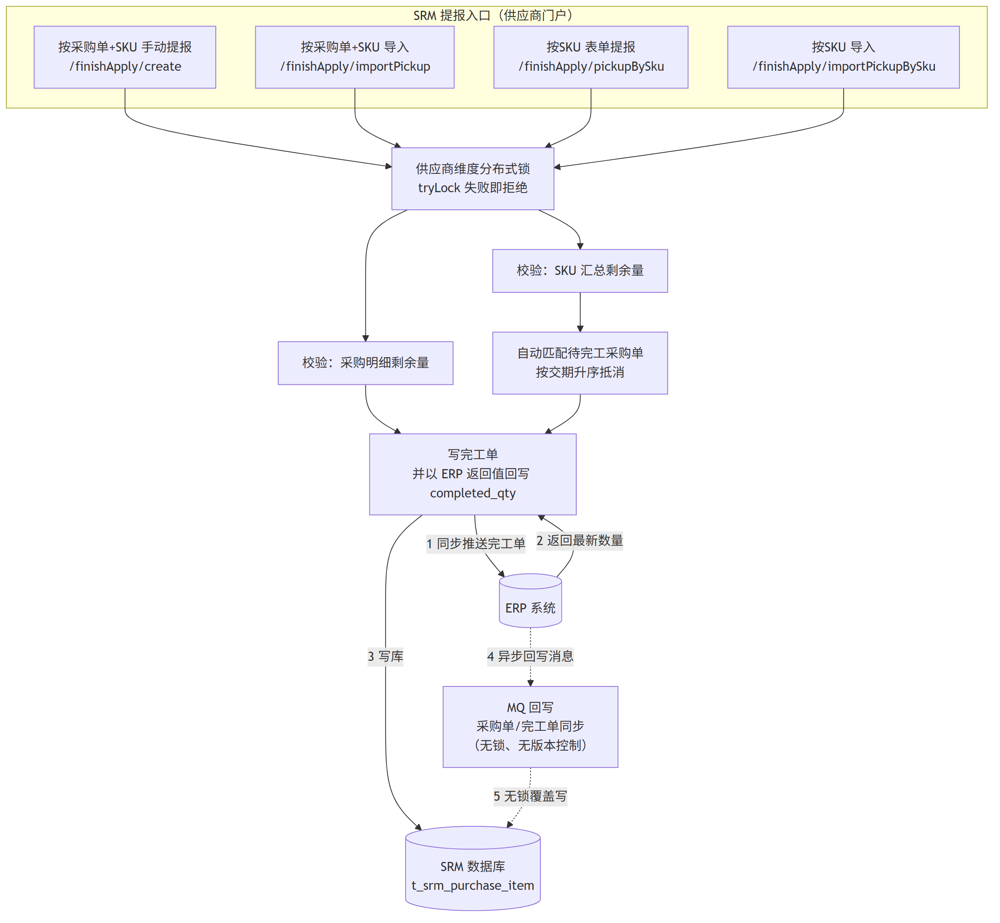

---

## 2. 问题与风险（现状分析）

### 2.1 问题清单

| 编号 | 问题 | 触发场景 | 业务后果 | 严重度 |
| --- | --- | --- | --- | --- |
| P1 | 分布式锁在**事务提交前**释放（方法内 finally 解锁，Spring 在方法返回后才提交事务） | 两个请求时间上紧邻：后到者落入"已解锁、未提交"窗口，读到旧值 | 超完工、同一数量被完工两次 | 高 |
| P2 | 按采购单手动提报 `create` 的累计校验使用**前端传来的累计完工数**，而非 DB 最新值 | 页面停留期间他人已提报；或前端值被篡改 | 校验形同虚设，超完工 | 高 |
| P3 | ERP 侧接收完工推送**无任何并发保护**，且对已提货数做"读-改-写"（非原子自增） | SRM 两请求同时穿透；或 SRM 推送与 ERP 人工提货同时发生 | ERP 侧丢失更新、超提货，并污染回写 SRM 的值 | 高 |
| P4 | MQ 消费**失败后吞掉异常直接 ACK**（不重试） | 消费时任何异常（DB 抖动、数据缺失等） | 消息丢失，SRM 与 ERP 永久不一致 | 高 |
| P5 | MQ 消费**无幂等** | 消息重投、ERP 重复发送 | 完工单重复创建、采购单重复覆盖写 | 中高 |
| P6 | MQ 采购单同步**无版本控制、整单覆盖写** | 消息乱序/延迟到达 | 新完工数被旧快照回退 | 中高 |
| P7 | ERP 侧产生的完工单经 MQ 回写 SRM 时**只建单、不占完工数** | 回写后、采购单同步消息到达前的空窗期内有人按 SKU 提报 | 重复完工 | 中 |
| P8 | 锁粒度过粗（整供应商）且 ERP HTTP 调用在事务+锁内 | 同供应商不同采购单互相阻塞；ERP 慢时持锁数秒 | 可用性差、报错"单据正在操作中"频繁 | 中 |
| P9 | 推送 ERP 无业务幂等键（每次生成新完工单号） | ERP 已成功但 SRM 提交失败回滚后重提 | ERP 侧重复单据 | 中 |

### 2.2 典型事故场景（给产品/测试的故事）

- **场景一（双人并发）**：张三点"按采购单提报"、李四同时点"按SKU提报"，且命中同一 SKU。李四的请求在张三"解锁但未提交"的毫秒窗口内读到旧剩余量，两单都通过校验 → 该 SKU 超完工，ERP 出现两张覆盖同一数量的完工单。
- **场景二（快速重试）**：用户看到"单据正在操作中"后连续点击重试，某次重试恰好落入窗口期 → 重复完工。
- **场景三（消息丢失）**：ERP 确认完工后发出采购单同步消息，SRM 消费时抛异常被吞 → SRM 完工数永远少一截，供应商可重复提报该部分数量。
- **场景四（消息乱序）**：两条采购单同步消息乱序到达，旧快照覆盖新值 → 完工数回退，待完工数虚增 → 超完工。
- **场景五（跨系统并发）**：ERP 采购员在 ERP 里人工做提货的同时，SRM 推送完工 → ERP 侧"读-改-写"互相覆盖，丢失其中一次增量。

### 2.3 竞态时序图

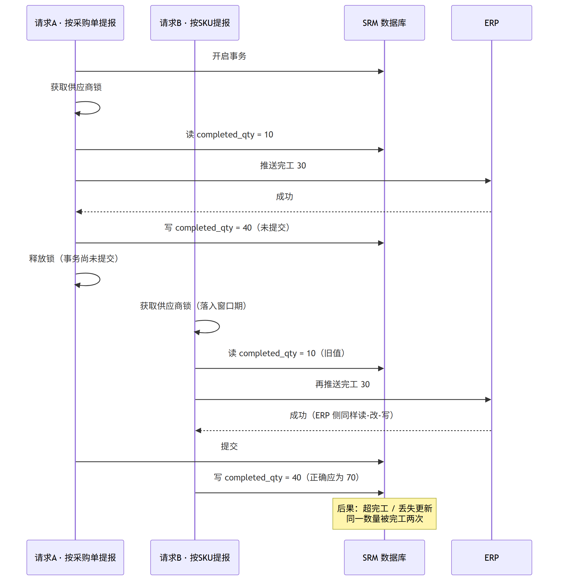

### 2.4 根因归纳

1. **把分布式锁当成了正确性保障**。锁只能保护进程临界区，保护不了"解锁→提交"缝隙，也管不住绕过锁的写方（MQ 回写）。正确性必须落在数据库最终写入语句上（业界库存/额度扣减的通行做法）。
2. **锁与事务顺序颠倒**：应先加锁、后开事务、提交后再解锁。
3. **校验数据源不可信**：用了前端值/事务外旧读值，而非锁内最新读值。
4. **跨系统写源无治理**：无幂等、无版本、无对账，双写必然漂移。

---

## 3. 目标与设计原则

**目标**

- G1 任何并发组合下不出现超完工、重复完工、数量回退；
- G2 SRM 与 ERP 数量最终一致，差异可发现、可修正；
- G3 锁粒度合理：同 SKU 串行、不同 SKU 并行，互不牵连；
- G4 消息不丢、不重、乱序可防；
- G5 对现有业务模式与用户体验影响最小，可灰度、可回滚。

**原则**

- **数据库条件更新是底线**：所有数量写入统一走 CAS 扣减，任何入口（含 MQ、管理端）不得绕过；
- **锁只做降竞争**：锁用于把冲突挡在校验之前、减少失败重试，不承担正确性职责；
- **锁包住事务**：加锁 → 事务 → 提交 → 解锁；
- **一切外部输入不可信**：校验一律用锁内 DB 最新值；
- **跨系统必幂等、必带版本、必对账**。

---

## 4. 总体方案：四层防御

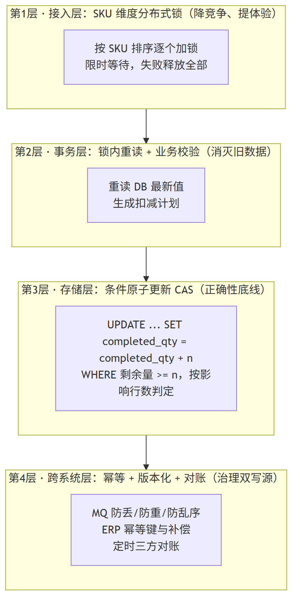

| 层 | 职责 | 手段 | 防住什么 |
| --- | --- | --- | --- |
| 第1层 接入层 | 降竞争、提体验 | SKU 维度分布式锁，排序加锁、限时等待 | 绝大多数并发直接串行化，减少失败 |
| 第2层 事务层 | 消灭旧数据 | 锁内重读 DB 最新值 + 业务校验 | 陈旧页面值、前端传值、窗口期旧读 |
| 第3层 存储层 | 正确性底线 | 条件原子更新 CAS，按影响行数判定 | 超完工/超扣，覆盖所有绕过锁的写方 |
| 第4层 跨系统层 | 治理双写源 | MQ 防丢/防重/防乱序、ERP 幂等与补偿、定时对账 | 消息丢失/重复/乱序、跨系统漂移 |

> 说明：第1~3层解决"同一时刻多人操作"，第4层解决"两个系统互相同步"。任何一层单独都不够，四层叠加后即使某层失效，系统也只是优雅失败而非数据错误。

---

## 5. 详细设计

### 5.1 第1层：SKU 维度分布式锁

**为什么锁 SKU 而不是锁采购单？**

按SKU自动匹配在提交时**不知道会命中哪些采购单**，若锁采购单需要"先无锁查候选→再锁→再重算"，多一个回环且候选集易变。而两条链路的真正竞争维度是**同一供应商、同一 SKU 的待完工额度**（额度分布在多张采购单上），且 **SKU 在两条链路提交时都是已知的**：

| 链路 | 提交时已知 | 加锁集合 |
| --- | --- | --- |
| 按采购单+SKU | 明细的 SKU 集合 | 每个 (供应商, SKU) |
| 按SKU | 提交的 SKU 集合 | 每个 (供应商, SKU) |

两链路共用同一锁命名空间 → 同 SKU 天然互斥；不同 SKU 完全并行。

**锁规约**

- 锁键：`srm:finish:consume:{supplierId}:{sku}`（替换现有供应商级键）；
- 获取：多 SKU 时**按键排序后顺序加锁**（固定序防死锁），`tryLock(waitTime=3~5s)`，任一失败则释放已持全部锁、整体快速失败，提示"资源繁忙请稍后重试"；
- 生命周期：**先加锁，再开事务；事务提交（或回滚）完成后再解锁**（修复 P1）；
- 管理端/代操作入口若存在，必须使用同一命名空间（以业务供应商ID为准，登录身份为空时禁止操作或显式传供应商ID）。

**粒度对比**

| 粒度 | 并发能力 | 能否覆盖自动匹配 | 结论 |
| --- | --- | --- | --- |
| 供应商（现状） | 差，同供应商全串行 | 能 | 弃用 |
| 采购单 | 好 | 需"查-锁-重算"回环，复杂 | 不采用 |
| SKU | 好，且两链路天然同维度 | 天然覆盖 | **采用** |

### 5.2 第2层：锁内重读 + 校验改用 DB 最新值

- 所有校验（剩余量、待返工量、累计上限）在**锁内、事务内**重新查询 DB；
- `create` 的累计校验**删除前端传值参与计算**（修复 P2），与导入/按SKU链路对齐；
- 按SKU链路的候选查询 `getOffsetCandidateItems` 移入锁内执行。

### 5.3 第3层：条件原子更新（CAS 扣减）——正确性底线

数量落库统一改为：

```sql
UPDATE t_srm_purchase_item
SET    completed_qty = completed_qty + #{n}
WHERE  purchase_item_id = #{id}
  AND  purchase_qty - COALESCE(cancel_qty,0) - completed_qty >= #{n};
-- 影响行数 = 0 视为"余量不足或被并发抢占"，回滚并提示
```

返工数同理（`rework_pending_qty >= #{n}` 条件扣减）。

**为什么它是底线**：该语句把"检查+扣减"合并为数据库内的原子操作，**任何写方**（两条提报链路、MQ 回写、管理端、未来的新入口）都无法把数量扣穿；即使锁全部失效，最坏结果也只是"影响行数0→业务失败"，而不是超完工。这是电商扣库存、账户扣余额的业界通行底座。

### 5.4 两条链路改造后流程

**通用骨架（按采购单+SKU）**

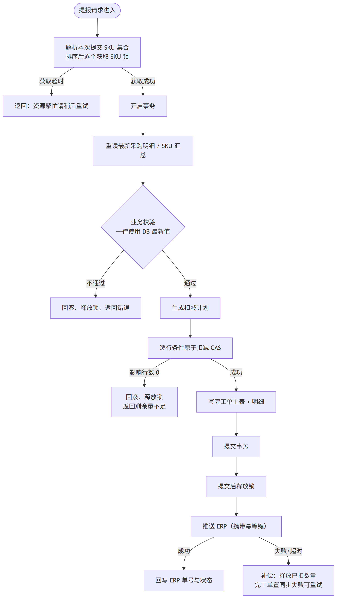

**按SKU自动匹配（含重试）**

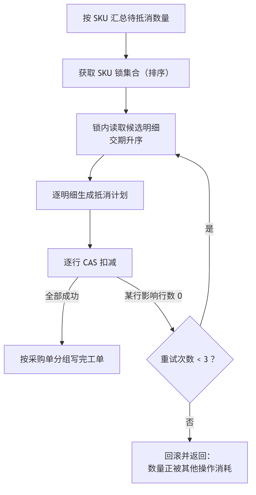

要点：

- 锁内读候选、生成抵消计划、逐行 CAS；某行影响行数为 0 时**重读候选重算**，重试上限 3 次，仍失败则整体回滚并提示"数量正被其他操作消耗，请稍后重试"；
- 单请求涉及多张采购单时，仍在一个事务内完成本地扣减与建单（原子性），ERP 推送见 5.5。

### 5.5 ERP 同步：事务边界、幂等与补偿

**路线 A（本期，渐进）**：保持同步推送，但做三件事——

1. ERP 推送**携带幂等键**（建议 `finishNo`，且 finishNo 在本地建单时生成、重提复用同一单号，修复 P9）；
2. 推送失败/超时 → 完工单置"同步失败"，**补偿任务**释放已扣数量或自动重推（二选一，评审定）；
3. 推动 ERP 侧将 `pickup_qty` 的更新改为**条件原子自增**（与 5.3 同款 SQL 思路，修复 P3），这是需要 ERP 团队配合的项。

**路线 B（后续演进，可选）**：事务性 Outbox——本地短事务完成"扣减+建单(待同步)"并提交，提交后异步推 ERP，成功回写、失败补偿。收益是事务更短、ERP 抖动不阻塞供应商；代价是引入状态机与补偿，改造量大，本期不做。

### 5.6 第4层：MQ 可靠性三件套（防丢失 / 防重复 / 防乱序）

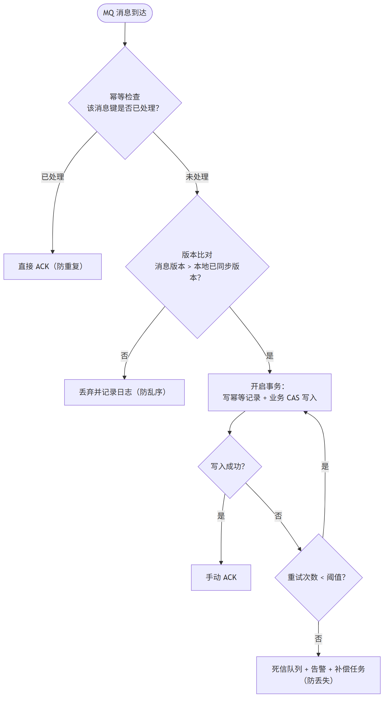

**5.6.1 防丢失（现状：消费异常被吞、直接 ACK → 消息永久丢失，修复 P4）**

- 改为**手动 ACK**：业务处理成功后才确认；
- 失败按策略重试（如 3 次、指数退避）；超过阈值进入**死信队列**；
- 死信 → **告警 + 补偿任务**定时扫描重放或人工处理；
- 消费逻辑保持幂等（见下），保证重试安全。

**5.6.2 防重复（现状：无幂等，修复 P5）**

- 建**消息消费幂等表** `t_srm_mq_consume_log`（消息唯一键 + 处理状态，唯一索引）；
- 消费事务内"先插幂等记录（唯一键冲突即视为已处理）+ 再写业务"，同事务提交；
- ERP 回写完工单以 `erpFinishId` 为业务幂等键，完工单表加唯一索引（修复 P7 的重复建单部分）。

**5.6.3 防乱序（现状：整单覆盖、无版本，修复 P6）**

- 消息携带 ERP 侧**版本号或更新时间**；SRM 记录 `synced_version`，仅当 `msg.version > synced_version` 才应用，否则丢弃并记日志（LWW）；
- **兜底（ERP 短期加不了版本时）**：MQ 采购单同步**不再覆盖完工数/待返工数等"完工流程自维护字段"**，只同步 ERP 独占字段（采购数、取消数、状态等），从根上消除回退面。

**5.6.4 顺序消费的取舍**

- 不强制全局顺序消息（改造大、吞吐差）。有了"幂等+版本LWW+CAS底线"后，**乱序不再造成数据错误**，顺序问题被降级为体验问题；
- 若后续评估仍需强顺序，可对采购单维度使用分区有序消息（同一 purchaseId 同分区），作为增强项。

### 5.7 对账：最后防线

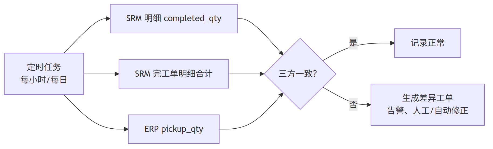

- 定时任务（建议每小时增量 + 每日全量）比对三方：SRM 明细 `completed_qty`、SRM 完工单明细合计、ERP `pickup_qty`；
- 差异 → 生成差异工单 + 告警；可自动修正的（如仅状态/单号缺失）自动修正，数量差异一律人工确认；
- 复用现有死代码 `updatePurchaseStatusByPickup`（按完工单合计重算）改造为修正工具。

### 5.8 数据库变更清单（草案，评审后定稿）

| 对象 | 变更 | 目的 |
| --- | --- | --- |
| `t_srm_purchase_item` | 新增 `synced_version`（可空） | MQ 版本化 LWW |
| `t_srm_mq_consume_log`（新表） | 消息唯一键（唯一索引）、事件类型、处理状态、重试次数、创建时间 | 消费幂等/防重/重试治理 |
| `t_srm_finish_apply` | `erp_finish_id` 唯一索引（允许空值语义按库特性处理） | 防 ERP 回写重复建单 |
| `t_srm_purchase_item` | 数量更新统一走 CAS 语句（代码层约束 + code review 把关） | 正确性底线 |
| ERP 库 `purchase_item` | `pickup_qty` 条件原子自增（ERP 团队执行） | 修复 ERP 侧丢失更新 |

---

## 6. 关键场景前后对照

| 场景 | 现状结果 | 改造后结果 |
| --- | --- | --- |
| 同供应商两人同时提报同 SKU（两链路各一） | 可能落入窗口期 → 超完工 | 第1层同 SKU 串行；即使穿透，第3层 CAS 使后到者失败 |
| 快速重试/双击 | 可能重复完工 | 锁等待+重读+CAS；重复推送由 ERP 幂等键拦截 |
| 不同 SKU 并发 | 被供应商锁互相阻塞 | 完全并行 |
| ERP 人工提货 与 SRM 推送同时 | ERP 丢失更新 | ERP 条件原子自增，双方都成功或后到者明确失败 |
| MQ 消费异常 | 消息丢失、永久不一致 | 重试→死信→告警→补偿 |
| MQ 重复投递 | 重复建单/覆盖 | 幂等表直接 ACK |
| MQ 乱序 | 完工数回退 | 版本 LWW 丢弃旧消息；兜底方案不覆盖自维护字段 |
| ERP 已收单但 SRM 回滚后重提 | ERP 重复单 | 复用同一 finishNo 幂等键，ERP 防重生效 |

---

## 7. 对产品与用户体验的影响

| 项 | 变化 | 说明 |
| --- | --- | --- |
| 报错文案 | "单据正在操作中" → 细化为"资源繁忙请稍后重试 / 剩余量不足 / 数量正被其他操作消耗" | 更准确，便于客服解释 |
| 等待体验 | 同 SKU 并发时后到者最多等待 3~5 秒再失败（现状为立即失败） | 用短暂等待换成功率 |
| 不同 SKU/不同单 | 不再互相阻塞 | 体验提升 |
| 提交响应时间 | 基本不变（路线A）；ERP 抖动时不再放大持锁 | — |
| 同步失败单据 | 新增"同步失败"状态与自动重推/补偿 | 需产品确认状态展示与文案 |
| 业务模式 | 两种提报模式、自动匹配规则、交期升序抵消逻辑均**不变** | 无功能回归风险外的行为变化 |

**需产品确认**：①"同步失败"状态的展示与操作（重试入口）；②自动匹配重试仍失败时的提示文案；③对账差异修正是否需要产品侧工单流程。

---

## 8. 测试方案（面向测试同事）

### 8.1 功能回归

- 两种模式正常提报、导入、错误数据导出、模板下载、列表/导出；
- 自动匹配顺序（交期升序）、跨单抵消、返工数抵消；
- 超限/负数/空值等校验文案。

### 8.2 并发用例（重点）

| 用例 | 操作 | 预期 |
| --- | --- | --- |
| C1 | 同供应商、同 SKU：按采购单 与 按SKU 同时提交 | 一成功一等待/失败；最终数量=两单之和，不超量 |
| C2 | 同 SKU 双窗口双击提交 | 不重复完工 |
| C3 | 同供应商不同 SKU 并发 | 互不阻塞，均成功 |
| C4 | 50 并发压同一 SKU（脚本） | 总完工数 ≤ 待完工数，失败方收到明确提示 |
| C5 | 锁等待超时 | 3~5s 后返回"资源繁忙" |
| C6 | CAS 重试路径 | 构造抢占场景，验证重试≤3 次与最终一致性 |

### 8.3 异常用例

| 用例 | 操作 | 预期 |
| --- | --- | --- |
| E1 | 模拟 ERP 推送超时/5xx | 完工单置同步失败；补偿释放或重推；数量不悬空 |
| E2 | 模拟 SRM 提交后 DB 回滚 | 不残留已扣数量 |
| E3 | MQ 重复投递同一消息 | 仅生效一次 |
| E4 | MQ 乱序（先发新后发旧） | 旧消息被丢弃，数量不回退 |
| E5 | MQ 消费抛异常 | 自动重试→死信→告警；补偿后数据一致 |
| E6 | ERP 人工提货与 SRM 推送并发（联调） | 无丢失更新 |

### 8.4 对账与数据验证

- 构造差异数据，验证对账任务产出差异工单与告警；
- 全量脚本比对三方数量（测试环境每日跑）。

### 8.5 性能

- 对比改造前后：同供应商并发提交 P95 响应时间、锁等待失败率；
- 观察 CAS 重试率（应 <1%）。

---

## 9. 上线与回滚计划

| 阶段 | 内容 | 开关/回滚 |
| --- | --- | --- |
| 阶段一（正确性） | CAS 扣减、锁顺序修正（提交后解锁）、create 校验改 DB 值 | 独立开关可回退旧写路径（灰度期双写校验） |
| 阶段二（锁粒度） | 供应商锁 → SKU 锁（灰度：先按供应商白名单） | 开关回退供应商锁 |
| 阶段三（跨系统） | MQ 手动ACK/幂等/版本LWW、ERP 幂等键、补偿任务 | 消费侧开关；ERP 侧独立发布 |
| 阶段四（兜底） | 对账任务、差异工单 | 只读任务，风险低 |

回滚原则：各阶段开关独立；回滚不影响已落库数据正确性（CAS 为纯增强）。

---

## 10. 风险与待确认问题（评审会重点）

| 编号 | 问题 | 需要谁 | 备注 |
| --- | --- | --- | --- |
| Q1 | 管理端/代操作是否存在完工入口？其 supplierId 为空时锁键如何统一？ | 开发 | 影响锁命名空间设计 |
| Q2 | ERP 能否配合：①pickup_qty 条件原子自增；②消息带版本号；③接收幂等键 | ERP 团队 | 决定 5.5/5.6 的主方案或兜底方案 |
| Q3 | 现网 MQ 的消费模式/并发度/重试配置现状 | 开发 | 评估手动 ACK 改造点 |
| Q4 | "同步失败"状态的产品展示与补偿策略（自动重推 vs 人工） | 产品 | |
| Q5 | 对账差异的自动修正边界 | 产品+开发 | 数量差异建议一律人工 |

---

## 附录 A：配图 Mermaid 源码（可修改后重新渲染）

> 图已渲染为 PNG 存于 `assets/` 目录；以下为源码，便于后续维护。渲染命令：`mmdc -i figX.mmd -o figX.png -p pup.json -b white -w 1600 -s 2`。

### 图1 现状流程

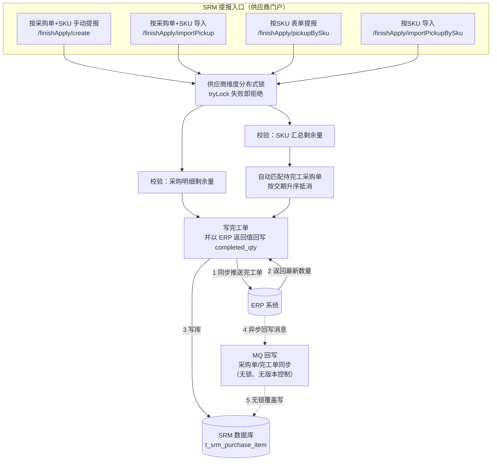

### 图2 并发竞态时序

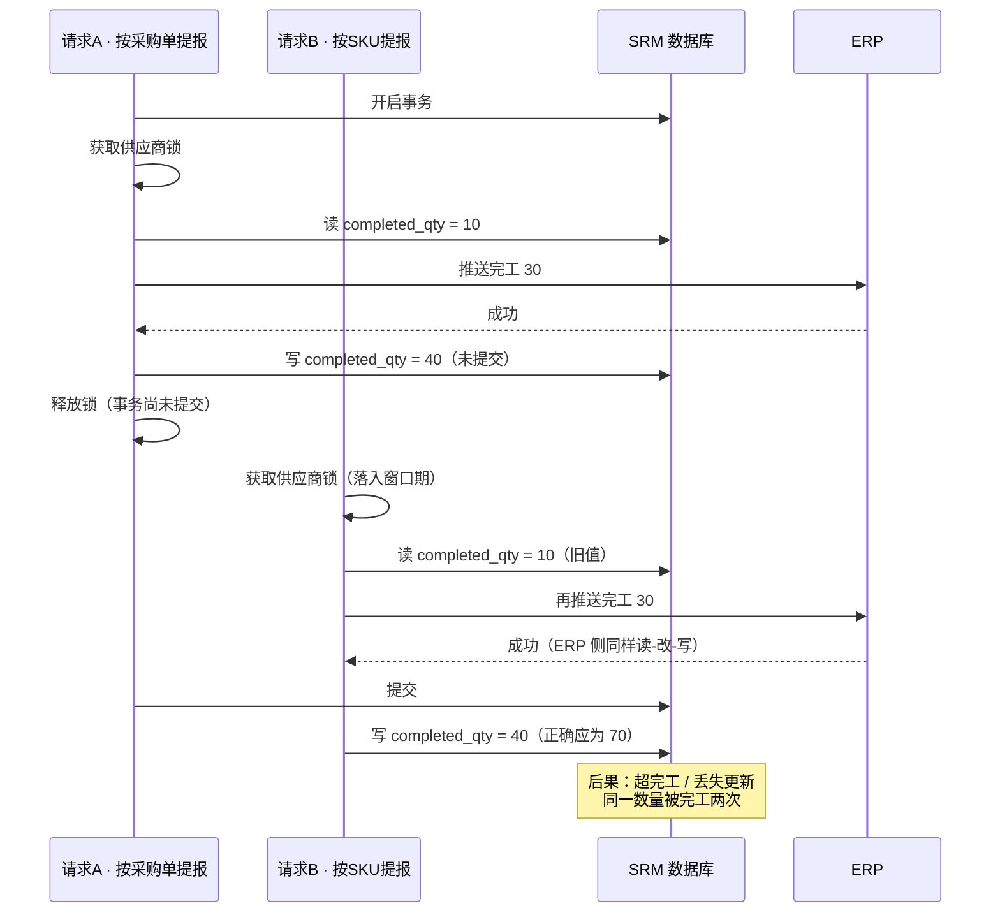

### 图3 四层防御架构

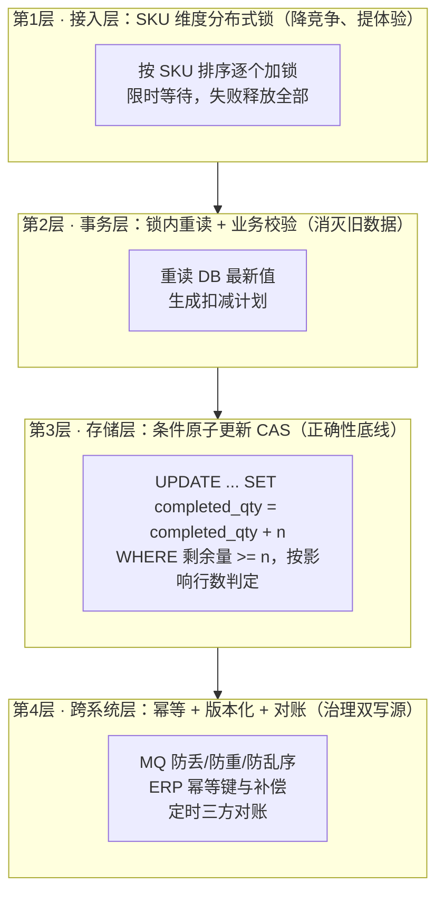

### 图4 改造后提报流程

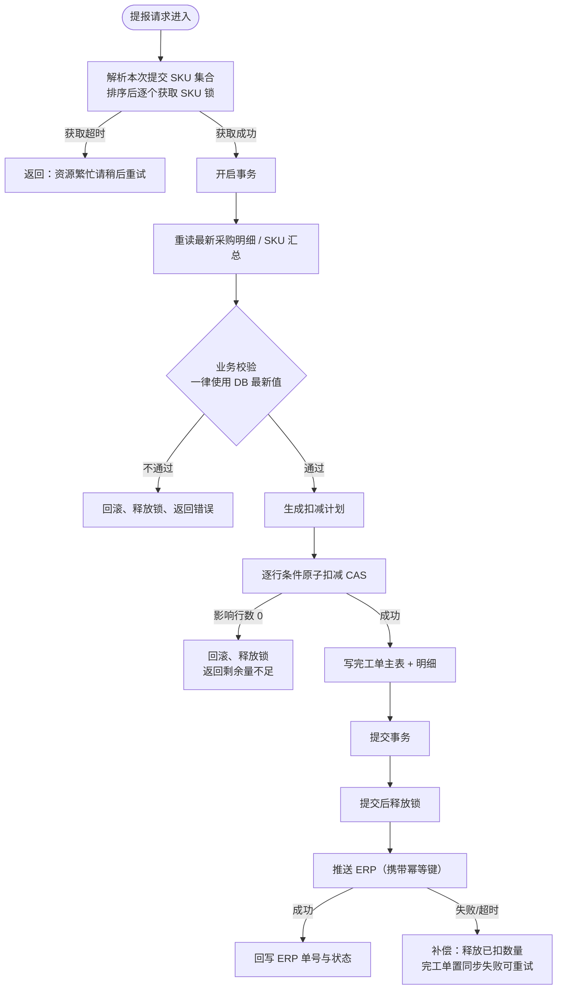

### 图5 按SKU自动匹配流程

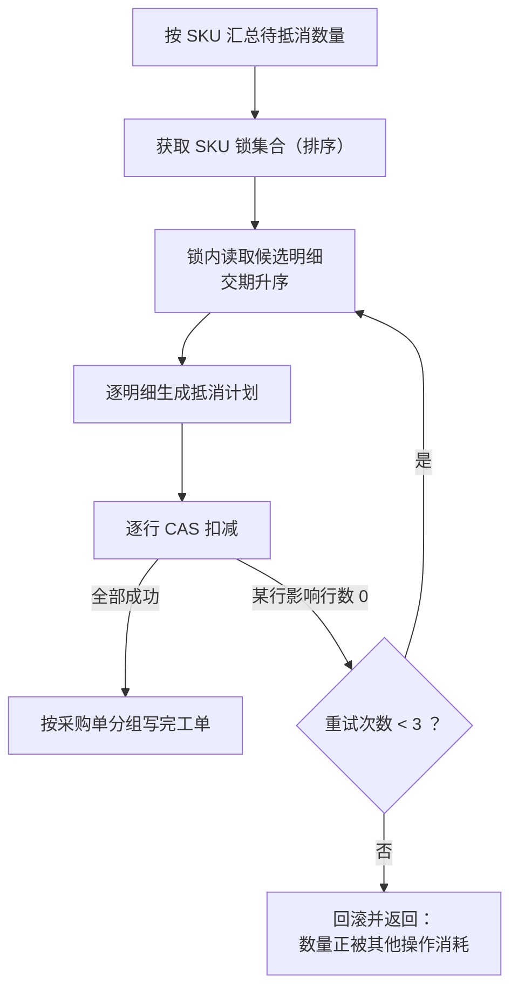

### 图6 MQ 可靠消费流程

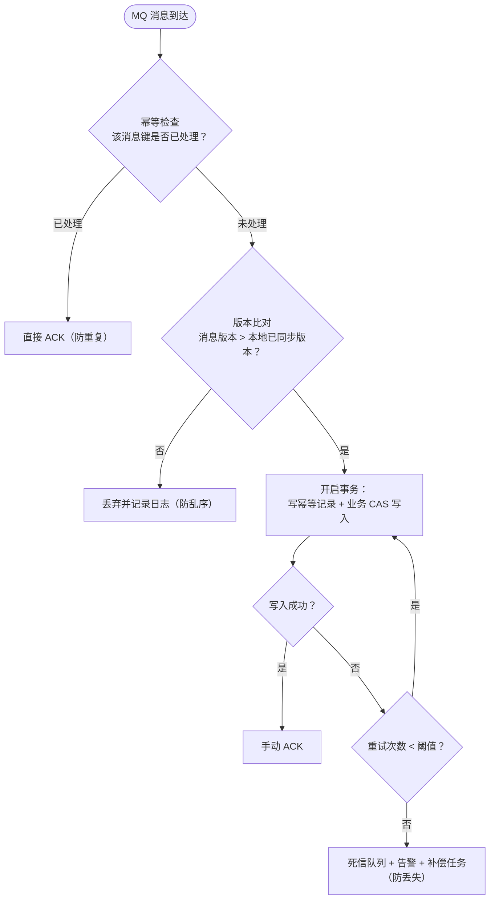

### 图7 三方对账

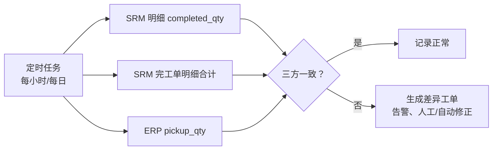

---

## 附录 B：相关代码位置索引

| 模块 | 路径 |
| --- | --- |
| 完工单服务实现（四入口/锁/校验/匹配/ERP推送） | `D:\myProgram\workCode\zr\srm\srm-backend\zr-srm\zr-srm-service\src\main\java\com\zr\srm\service\service\srm\impl\FinishApplyServiceImpl.java` |
| 完工单控制器 | `...\controller\srm\FinishApplyController.java` |
| 采购单状态更新/回写 | `...\service\srm\impl\PurchaseOrderServiceImpl.java`（updatePurchaseStatus 第183行；updatePurchaseStatusByPickup 第121行-死代码可改对账） |
| MQ 消费入口（吞异常处） | `...\mq\EventMessageListener.java` |
| MQ 采购单同步（覆盖写） | `...\handler\message\PurchaseMessageHandler.java` |
| MQ 完工单回写（不占量） | `...\handler\message\FinishApplyMessageHandler.java` |
| SKU 统计/候选明细 SQL | `...\resources\mapper\PurchaseItemMapper.xml`（getSkuStatistics / getOffsetCandidateItems） |
| 锁键常量 | `...\zr-srm-api\...\constant\Constants.java`（SRM_OPERATE_PURCHASE 第12行） |
| ERP 接收完工推送（无锁/读-改-写） | `D:\myProgram\workCode\zr\xzy-ai\xzy\xzy-erp-public\xzy-pms\src\main\java\com\xzy\erp\pms\service\impl\PickupServiceImpl.java`（addPickupBySrm 第1545行；updatePurchaseInfo 第677行） |

## 附录 C：业界实践参考

- 电商库存扣减：DB 条件原子扣减为底座，前置缓存/锁降并发，异步对账兜底；
- 分布式锁最佳实践：锁粒度=竞争资源维度；锁必须包住事务提交；多锁固定序防死锁；
- 跨系统数据同步：幂等键 + 版本号 LWW + 死信补偿 + 定期对账（CDC/事件驱动架构通行做法）。

---

（文档完）
